# Dev-C++

Dev-C++是由Bloodshed開發的一套IDE，不過自2005年初後，便不再更新，2011年由Orwell接手維護非官方版本，這邊安裝教學使用 Orwell Dev-C++ 5.11。  
目前仍有不少高中、大學的用其作為C語言授課用程式，但由於功能不甚完備，故在此不推薦使用。

> **適用平台：Windows Only (Windows XP或以上)**

## 安裝
1. 先到 [Orwell Dev-C++](http://orwelldevcpp.blogspot.tw/) 下載安裝程式。  
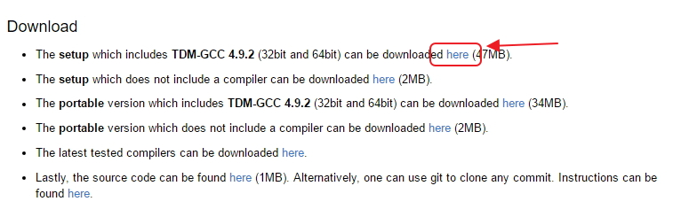

2. 執行安裝程式。  
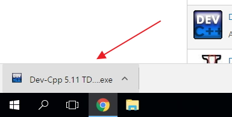

3. 如果出現這個畫面，請按執行(Run)。  
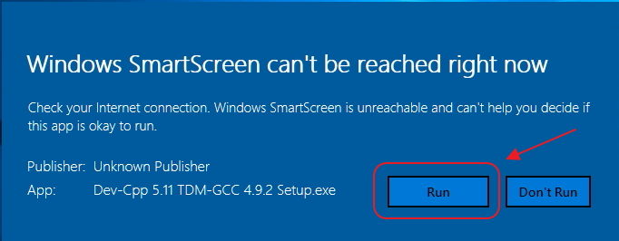

4. 選「English」，按下OK。  
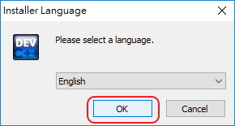

5. 按下「I Agree」。  
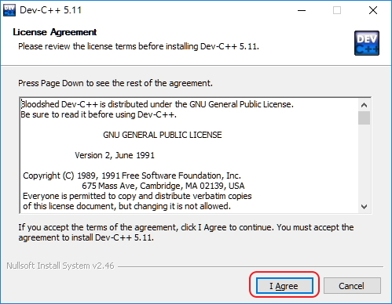

6. 按下「Next」。  
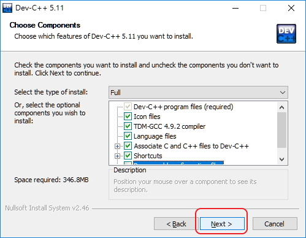

7. 按下「Install」。  
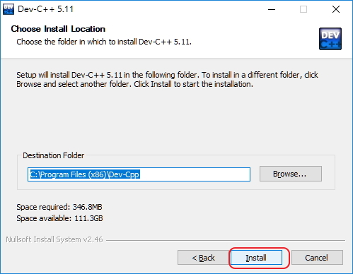

8. 按下「Finish」。  
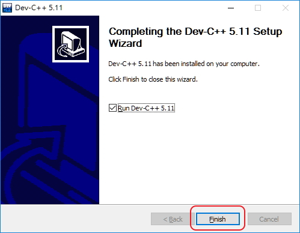
到這個步驟，你的Dev-C++就已經安裝完成了。  

## 第一次開啟
第一次開啟需要進行一些設定：  
1. 選擇「Chinese(TW)」，並按下「Next」。  
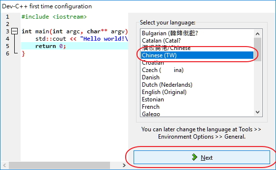

2. 按下「下一步」。  
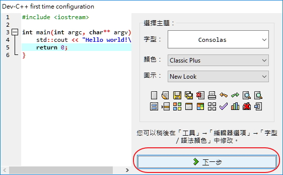

3. 按下「完成」。  
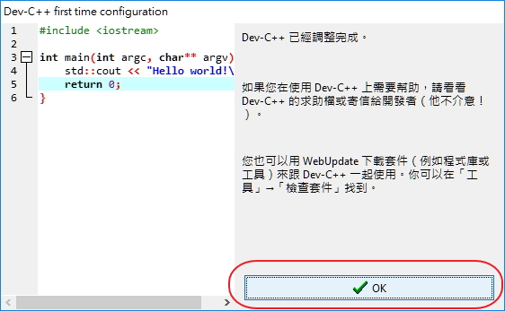

當你看到下面這個畫面，就代表你的Dev-C++設定完畢！  
這個步驟只需要在安裝後的第一次開起執行，之後不會再次遇到這個畫面。  
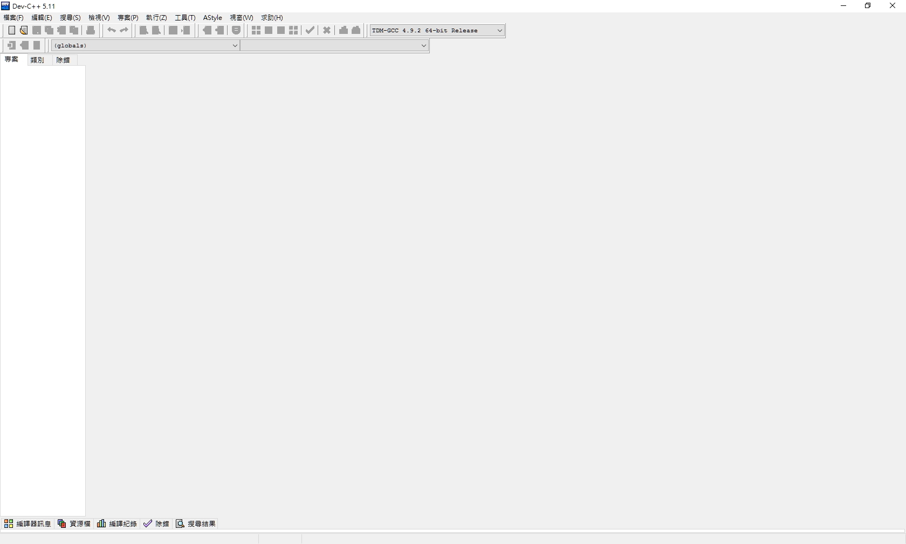

## 編譯及執行
1. 開新檔案。  
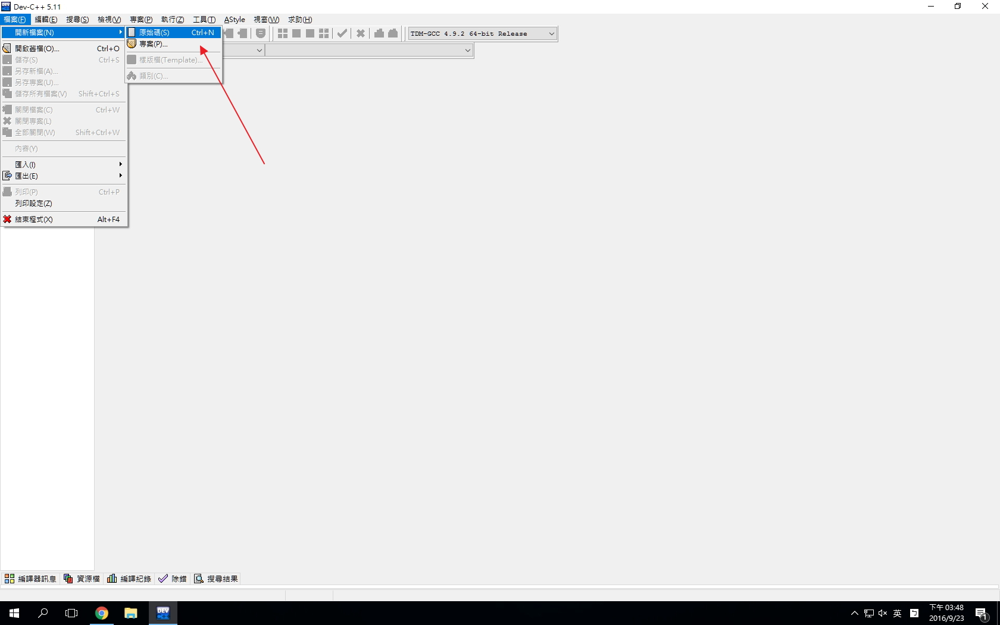

2. 撰寫完畢之後，按下上方的按鈕。  
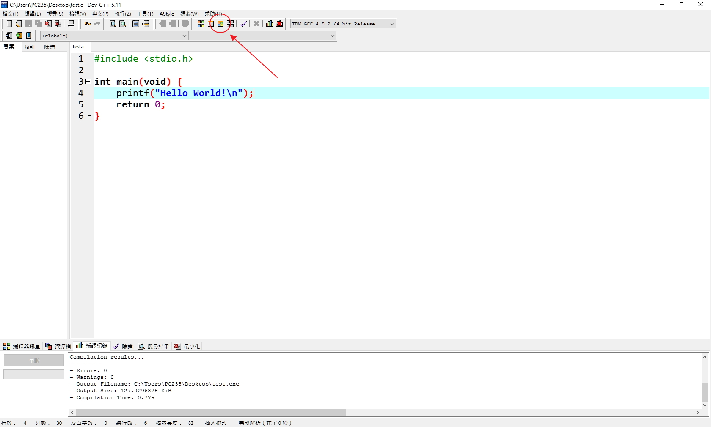

3. 如果出現黑色主控台視窗，即表示撰寫正確，程式正常開始執行。  
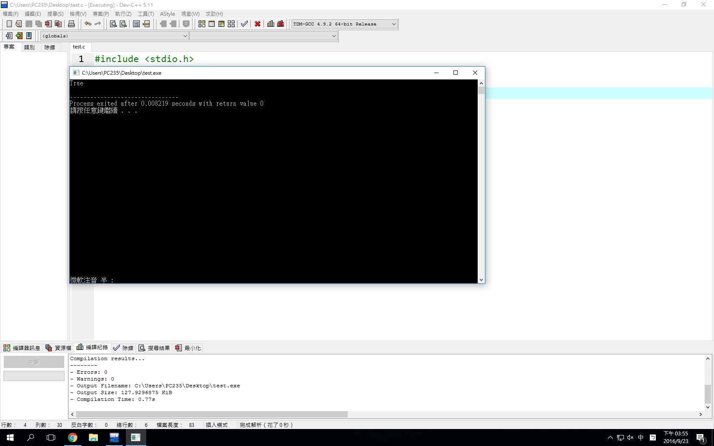