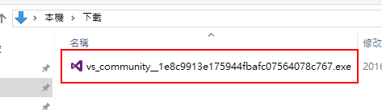
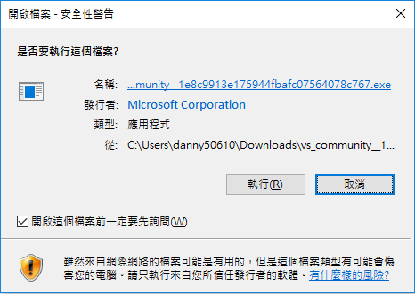
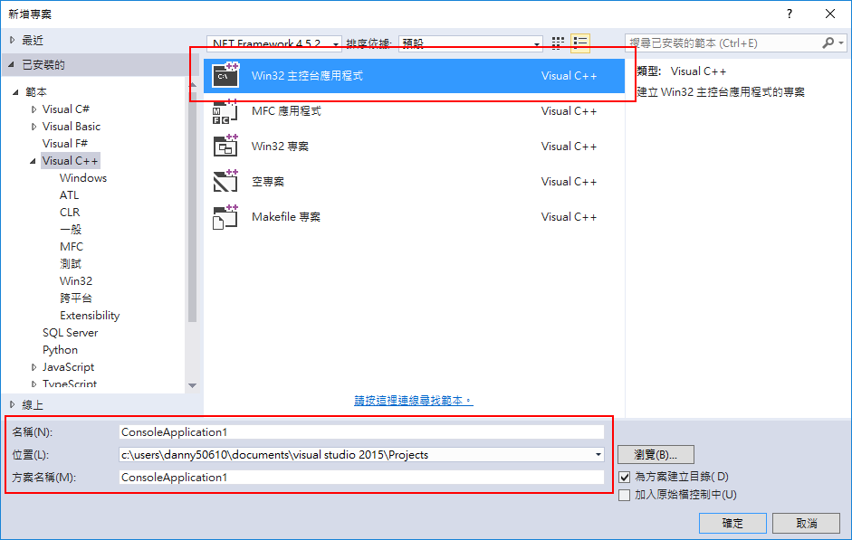
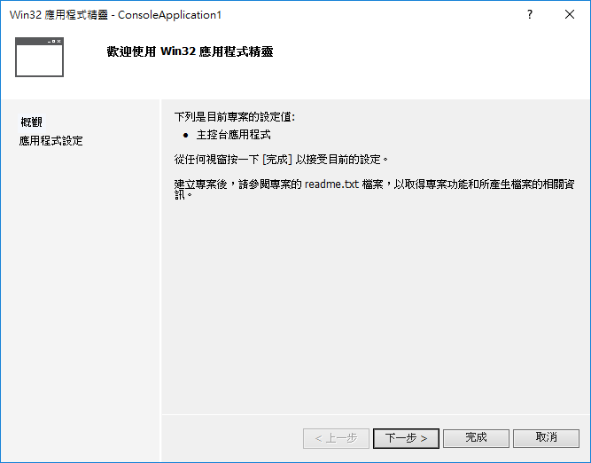
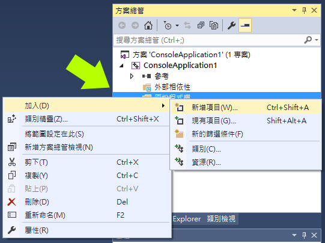

# Visual Studio

Visual Studio 是 Microsoft 開發的一套非常強大的IDE  
這邊的教學使用 Visual Studio Community 2015  

> **適用平台：Windows Only (Windows 7 SP1或以上)**  
> 其他平台可以參考`Visual Studio Code`，但是功能上有差異

備註：  
1. 安裝會需要大量的網路與硬碟空間，視選擇的套件而定
2. 會需要一個 Microsoft 的帳號啟動軟體(免費的)

## 安裝
1. 先到 https://www.visualstudio.com/zh-tw/products/visual-studio-community-vs.aspx  
   點選「下載 Community 2015」  

2. 執行安裝程式  

3. 跳出安全性警告，確定發行者名稱是否跟圖片相同，點選「執行」  

4. 安裝程式準備中...  

5. 「選擇安裝類型」為「自訂」，點「下一步」  

6. 因為要寫 C / C++ 程式   
   所以勾選「 Visual C++」，點選「下一步」  

7. 點選「安裝」  

8. 安裝中......(要一段時間，可以去喝個咖啡)  

9. 安裝完成，點選「啟動」  

10. 點選「登入」，登入自己的 Microsoft 帳號(第一次啟動會需要)  

11. 登入完成後，可以看到啟動的 Visual Studio Community 2015  

## 設定
這邊基本上教大家調字體大小，其他的設定可以自行摸索
1. 點選工具列「工具」/「選項」  

2. 左側選到「環境」/「字型與色彩」  
   將「大小」調至「14」(這邊可以依個人喜好調整)  
   按下「確定」

## 建立第一個專案
1. 點選工具列「檔案」/「新增」/「專案」  

2. 選擇「Win32 主控台應用程式」  
   `專案名稱`、`位置`、`方案名稱`可以自己設定  
   按下「確定」  

3. 按下「下一步」  

4. 勾選「空專案」  
   取消勾選「安全性開發週期(SDL)檢查」  
   按下「完成」  

5. 在右側的「方案總管」中  
   在「原始程式檔」按右鍵  
   選擇「加入」/「新增項目」  

6. 選擇「C++檔」  
   檔名可以自訂，按下「新增」

7. 打上下面示範用程式碼  

  
  #include <stdio.h>

  int main() {
      printf("Hello, world");
      return 0;
  }
  

  

8. 按下「本機 Windows 偵測工具」  
   點選「是」

9. 順利的話，程式會順利的執行  
   然後順利的結束  

10. 要看到執行的結果  
    需要使用中斷點  
    請在第 5 行左邊灰色處點一下，出現紅色圓圈

11. 按下「本機 Windows 偵測工具」  
    程式準備要執行第 5 行時會停下來  
    此時就可以看到輸出的結果

## 其他
剛剛我們是新增專案，所以下次繼續寫時，要開啟專案(不是檔案喔)  
方法一：
   直接點`ConsoleApplication1.sln`兩下

方法二：
   或是用「檔案」/「開啟」/「專案/方案」  
   然後開啟`ConsoleApplication1.sln`

