# Chapter 0：魔工鑄器 Environment

## Dev-C++

## Code::Blocks

## CLion

## Visual Studio

Visual Studio 是 Microsoft 開發的一套非常強大的IDE。這邊的安裝教學使用Visual Studio Community 2015。  

備註：  
1. 安裝會需要大量的網路與硬碟空間，視選擇的套件而定。
2. 會需要一個 Microsoft 的帳號啟動(免費的)

### 安裝
1. 先到 https://www.visualstudio.com/zh-tw/products/visual-studio-community-vs.aspx  
   點選「下載 Community 2015」  
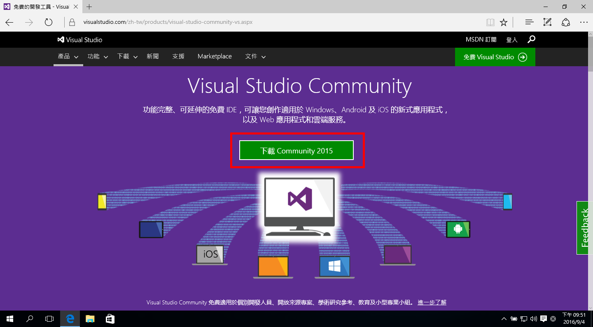

2. 執行安裝程式  
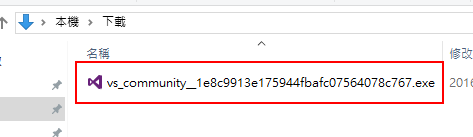

3. 跳出安全性警告，確定發行者名稱是否跟圖片相同，點選「執行」  
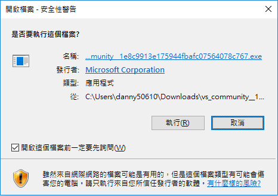

4. 安裝程式準備中...  
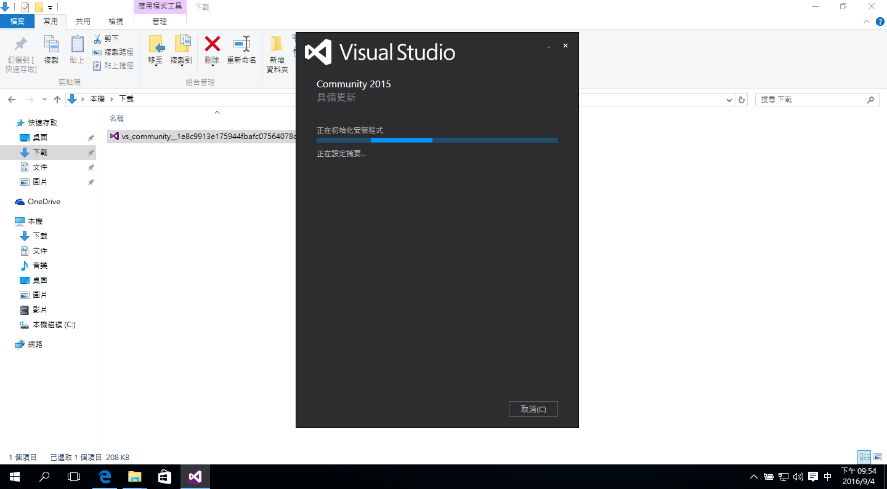

5. 「選擇安裝類型」為「自訂」，點「下一步」  
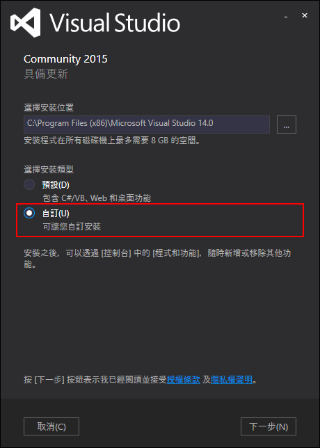

6. 勾選「 Visual C++」，點選「下一步」  

7. 點選「安裝」  
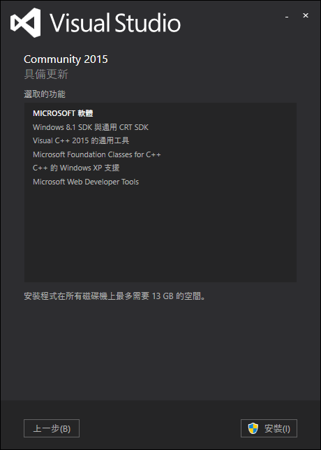

8. 安裝中......(要一段時間，可以去喝個咖啡)  
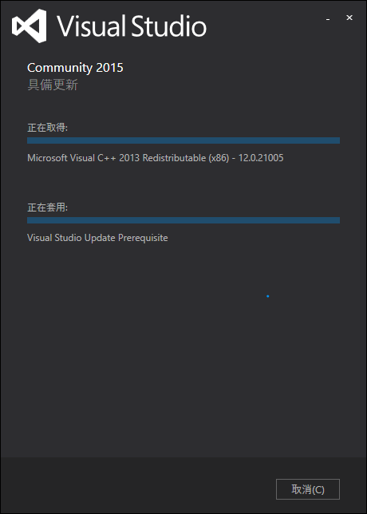

9. 安裝完成，點選「啟動」  
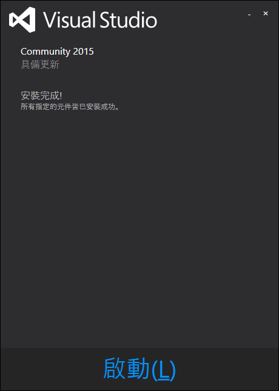

10. 點選「登入」，登入自己的 Microsoft 帳號(第一次開啟會需要)  
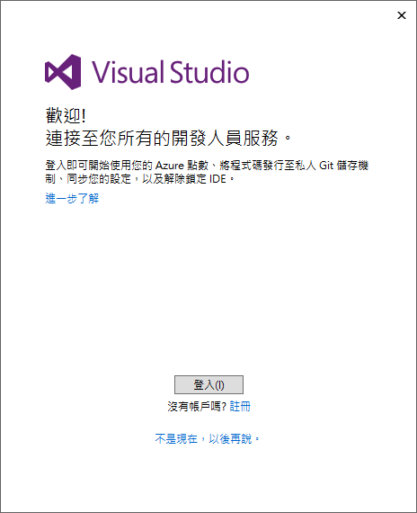

11. 登入完成後，會自動開啟 Visual Studio Community 2015  
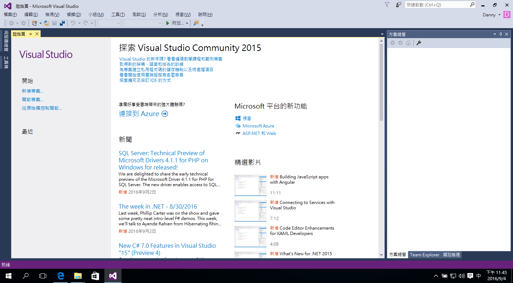

### 設定
基本上這邊教大家調字體大小，其他的可以自行摸索
1. 點選工具列「工具」/「選項」  
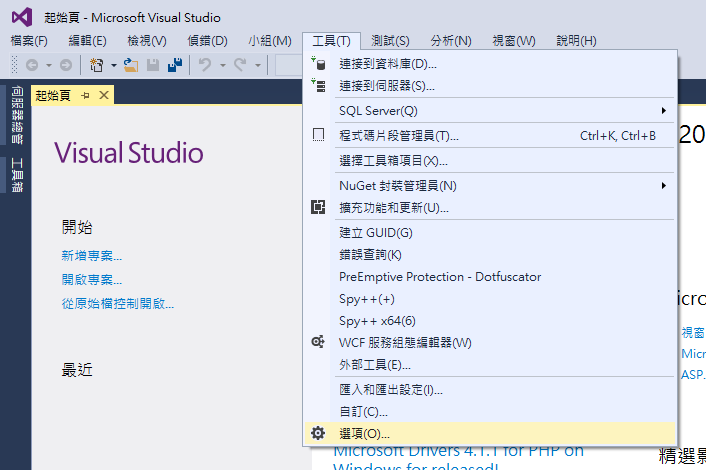

2. 左側選到「環境」/「字型與色彩」  
   將「大小」調至「14」(這邊可以依個人喜好調整)  
   按下「確定」
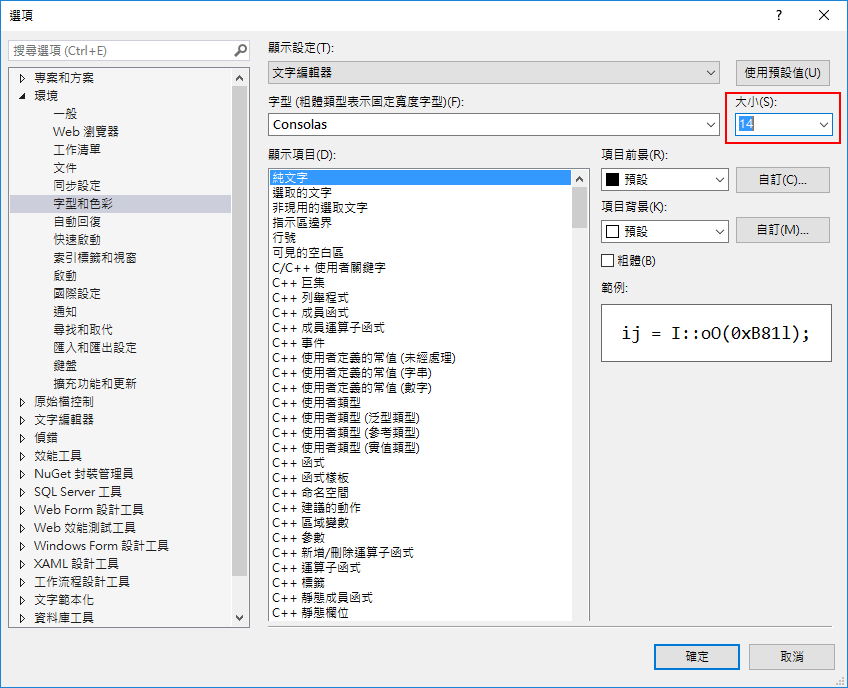

### 建立第一個專案
### 其他
寫程式有各式各樣的方法，只要程式寫得出來都是好方法， 
<b>阿!抄作業的方法在這邊不適用，被發現直接當掉，掰~<b>
就算你用記事本寫都沒問題， 
助教群，有一半是記事本(純文字編輯器)派的 