# Visual Studio

Visual Studio 是 Microsoft 開發的一套非常強大的IDE  
這邊的教學使用 Visual Studio Community 2015  

> **適用平台：Windows Only (Windows 7 SP1或以上)**  
> 其他平台可以參考`Visual Studio Code`，但是功能上有差異

備註：  
1. 安裝會需要大量的網路與硬碟空間，視選擇的套件而定
2. 會需要一個 Microsoft 的帳號啟動軟體(免費的)

## 安裝
1. 先到 https://www.visualstudio.com/zh-tw/products/visual-studio-community-vs.aspx  
   點選「下載 Community 2015」  
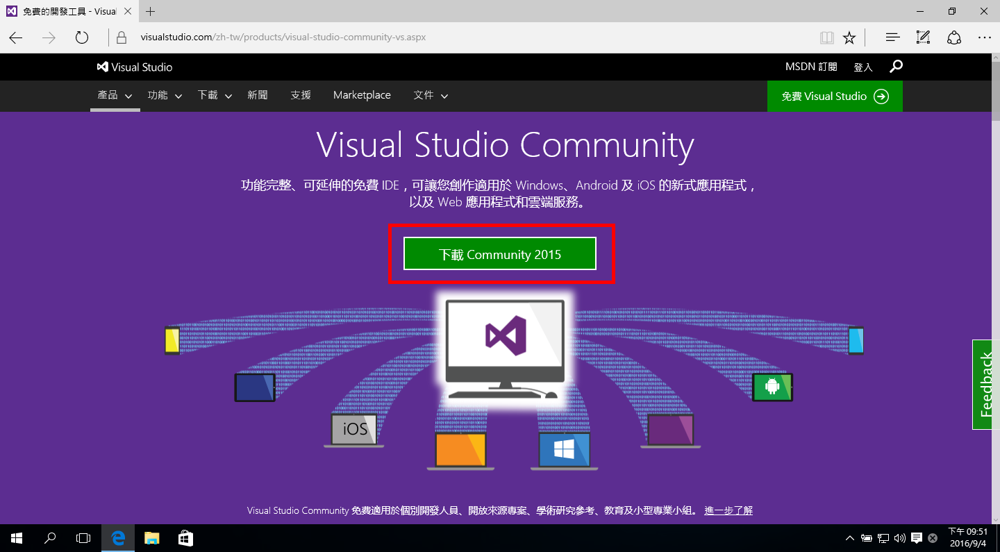

2. 執行安裝程式  
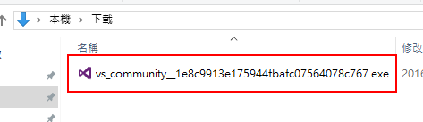

3. 跳出安全性警告，確定發行者名稱是否跟圖片相同，點選「執行」  

4. 安裝程式準備中...  
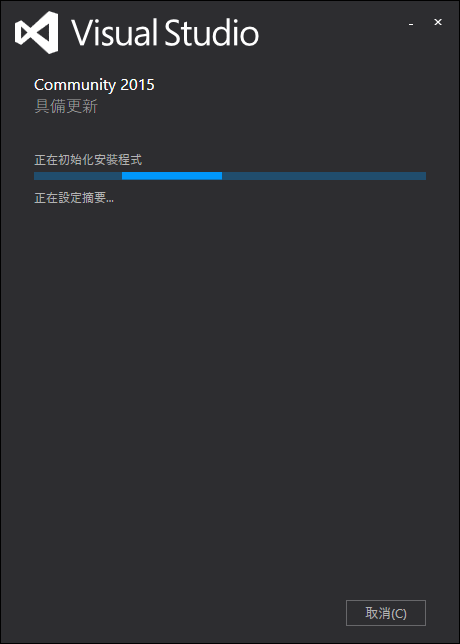

5. 「選擇安裝類型」為「自訂」，點「下一步」  
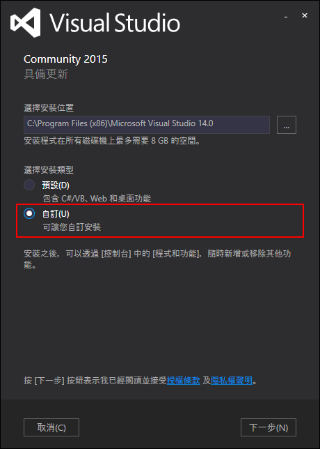

6. 因為要寫 C / C++ 程式   
   所以勾選「 Visual C++」，點選「下一步」  
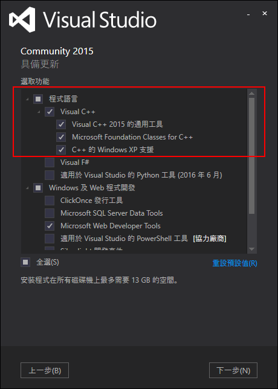

7. 點選「安裝」  
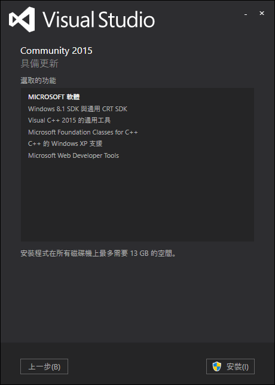

8. 安裝中......(要一段時間，可以去喝個咖啡)  
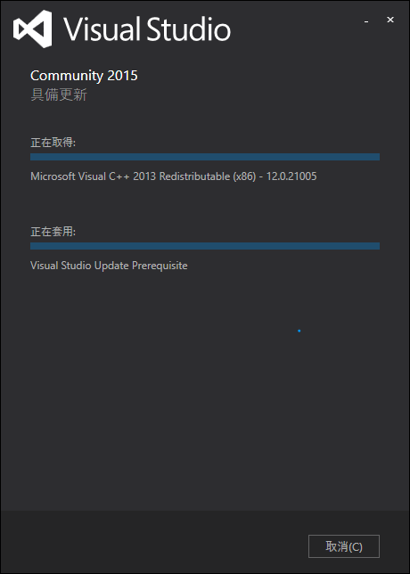
9. 安裝完成，點選「啟動」  
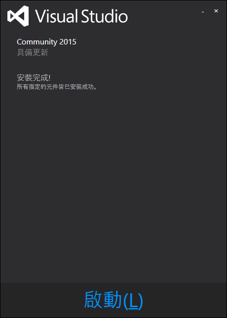

10. 點選「登入」，登入自己的 Microsoft 帳號(第一次啟動會需要)  
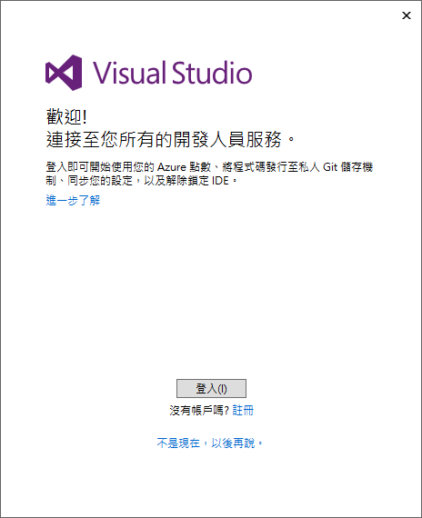

11. 登入完成後，可以看到啟動的 Visual Studio Community 2015  
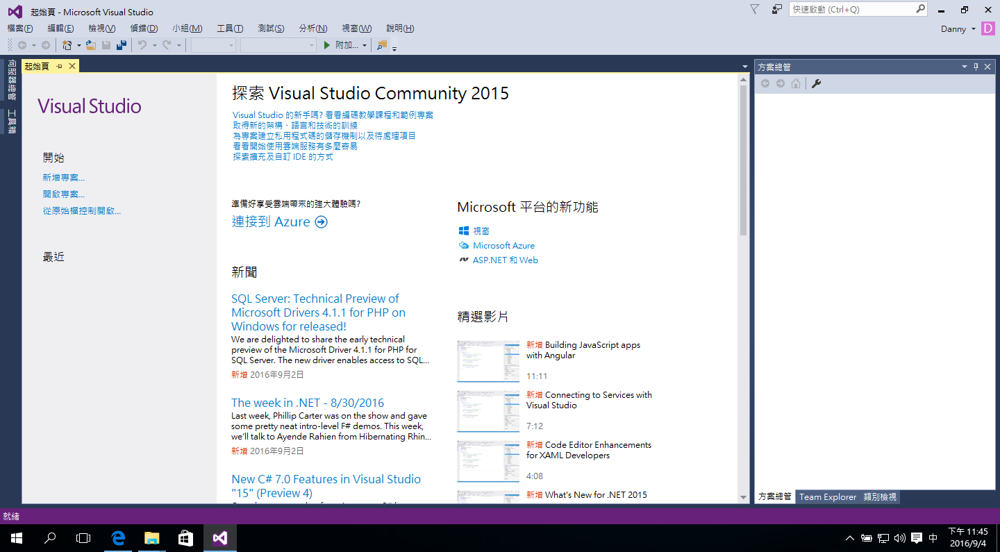

## 設定
這邊基本上教大家調字體大小，其他的設定可以自行摸索
1. 點選工具列「工具」/「選項」  
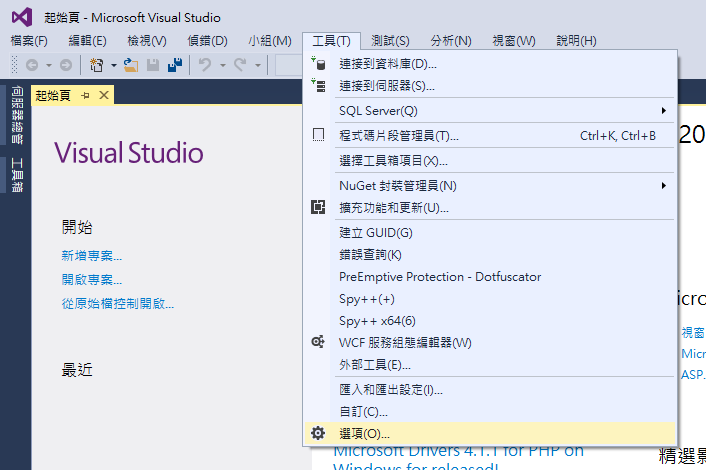

2. 左側選到「環境」/「字型與色彩」  
   將「大小」調至「14」(這邊可以依個人喜好調整)  
   按下「確定」
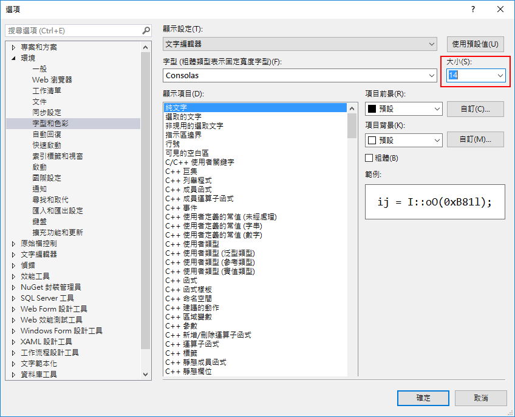

## 建立第一個專案

## 其他
