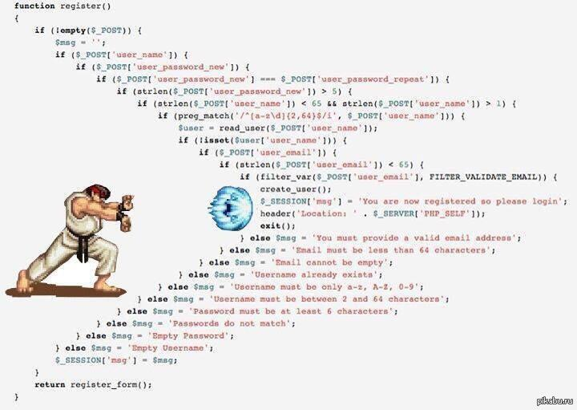

# 起手式
學習每個程式語言的第一件事情，  
通常就是先做個簡單的程式來運行一下。  

來寫寫上大學之後的第一支程式吧!  
將指定的文字輸出到主控台上  
(寫到大四還在寫的Hello, world!  


#include <stdio.h>

int main()
{
   printf("Hello world!\n");
   return 0;
}


##語法 Syntax
就像英文有文法、中文也有文法一樣， 
每個程式語言也有它自己的語法， 
有嚴謹的，也有較寬鬆的， 
之後會一一介紹。

## 標頭檔 Header
告訴編譯器(compiler)會用到哪些函式庫

#include<stdio.h>


告訴編譯器這個程式會用到 stdio.h這個表頭檔(Header file)中的函示定義  
* stdio = standard input and output
* 標準輸入輸出

## 主程式 Main
程式開始的地方

int main(){
    ...
}

寫了一大堆程式碼，總是要從一個地方開始執行  
由main開始  

主程式；Main function，程式進入點(Entry point)是main()這個函式  
int；執行完畢後回傳整數型態(將在**五型殺氣 Basic I/O**詳細介紹)  
( )；參數定義(將在**三千世界 Function**詳細介紹)  
{ }；程式內容(裡面就是這支程式要做的事情)  

## 程式主體

printf("Hello world!\n");
  //印出 Hello world!
  //"\n"代表換行符號
return 0;
  //程式成功結束


`printf` ：印出後面參數內容(誇號內之內容，可用雙引號包含一段文字)，為C語言提供的標準輸出函式  
`return` ：回傳值，程式結束後會回傳一個數值，通常 0 表示正常結束(將在**三千世界 Function**詳細介紹)   
`\n` ：換行符號，程式不會自動換行，如果沒加，下段文字會接在後面繼續寫  

## 註解 Comment
* 有點像是備忘錄，對自己寫的程式碼來點解釋
    * 別人看不懂你的程式碼  
    * 看不懂自己的程式碼  
    * 作筆記  
    * 不算程式碼的內容  

註解很重要，英文更重要，不懂英文，就看不懂註解，不懂註解就會處於一種尷尬的狀態。   


//我是單行註解



/*
    我是多行註解1
    我是多行註解2
*/

## 縮排 Indent


#include <stdio.h>
int main(){
printf("Hello world!\n");
return 0;
}

比起上面來講，

#include <stdio.h>

int main()
{
   printf("Hello world!\n");
   return 0;
}

這個看起來會比較輕鬆愜意。

## 編譯 Compile
* 還記得一開始講的程式編譯過程嘛
  * 原始程式 --> 經由編譯器 --> 目的檔 --> 經由連結器 --> 執行檔  
  * `source.c` --> COMPILER --> `source.o` --> LINKER --> `source.exe`  
* 編譯、執行方式
  * gcc source.c -o run.exe
  * ./run.exe
* 這時候就要說到 IDE 的方便了
  * F9 (Build and run)
  * 只需要按一下

### 練習 1-1
[練習1-1](05_practice.md)

## 主控台 Console
一開始先學會使用純文字模式顯示，  
可能不像視窗化的程式(GUI)寫起來有成就感。  
只需要考慮程式邏輯，不用考慮排版，  
對初學者來說，更容易紮實的學習語言

### 練習 1-2
[練習1-2](05_practice.md)