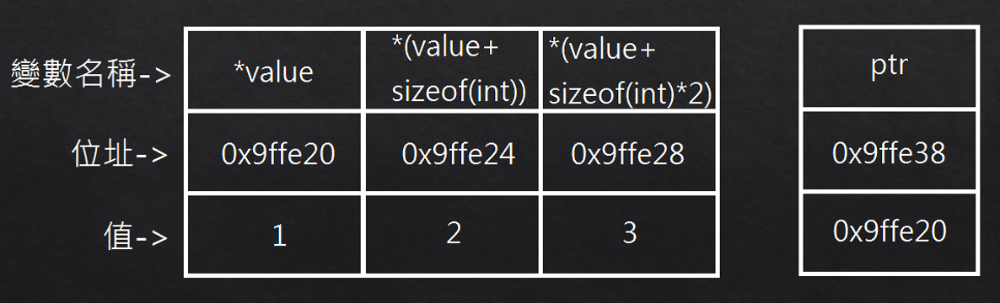
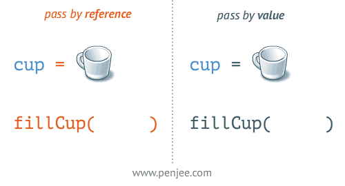

# 記憶體操作

本章節將重點在使用struct*進行struct陣列的實作。

在這之前我們先對指標(pointer)進行複習，也可參考本書第七章(鬼門遁甲 Pointer)。

## 複習：指標(Pointer)

>指標是一把鑰匙，這把鑰匙可以去打開一個置物櫃，而那個置物櫃裡可能會是資料或者另一把鑰匙。

指標可以視為一種資料型態，該資料型態儲存的資料唯一位址。

使用符號`*`可以將儲存位址的值取出，使用符號`&`可以將本地位址取出。請參考範例10-16

### 範例10-16


#include <iostream>
#include <string>
using namespace std;
int main(){
    int* pointer;
    int value=1;
    pointer = &value;
    cout << "    value:" << value << ", &value:" << &value << endl;
    cout << "* pointer:" << * pointer << ",pointer:" << pointer << " ,&pointer:" << &pointer << endl;
    return 0;
}


從上述範例可以看到，第七行我們將`pointer`的值設定為`value`的位址，以此練習了`*`及`&`的應用。

陣列也是指標的應用之一，請參考範例10-17

### 範例10-17


#include <iostream>
#include <string>
using namespace std;
int main(){
    int* ptr;
    int value[3]={1,2,3};
    ptr = value;
    cout << "value[0]:" << value[0] << ", &value[0]:" << &value[0] << endl;
    cout << "value[1]:" << value[1] << ", &value[1]:" << &value[1] << endl;
    cout << "value[2]:" << value[2] << ", &value[2]:" << &value[2] << endl;
    cout << "value:" << value << ", &value:" << &value << ",* value:" << * value << endl;
    cout << "* ptr:" << ptr << ", &ptr:" << &ptr << " ,* ptr:" << * ptr << endl;
    return 0;
}


請參考圖片配合範例10-17

### 練習10-17
請參考圖片用另一種方式將陣列值印出，例:`cout << "*(value+1):" << *(value+1) << endl;`

另外，關於函式(function)中的參數，我們也可以放上指標，呼叫時就會傳位址給函式，這時我們在函式中改動值會影響到該參數，請比較範例10-18兩個程式。

### 範例10-18


#include <iostream>
#include <string>
using namespace std;
void valuePlusplus(int value){
    value++;
    cout << "in function value:" << value << endl;
}
int main(){
    int value = 0;
    valuePlusplus(value);
    cout << "in main value:" << value << endl;
    return 0;
}



#include <iostream>
#include <string>
using namespace std;
void valuePlusplus(int * value){
    (* value)++;
    cout << "in function value:" << * value << endl;
}
int main(){
    int value = 0;
    valuePlusplus(&value);
    cout << "in main value:" << value << endl;
    return 0;
}


請參考圖片：

## struct-array by pointer

### 範例10-19


#include <iostream>
#include <string>
using namespace std;
struct fraction{
    int son;
    unsigned int mom;
    double toDouble(){
        double dnum = son;
        return dnum/mom;
    }
    fraction(){}
    fraction(int s,unsigned int m){
        son = s;
        mom = (m!=0)?m:1;
    }
    ~fraction(){
        cout << toDouble() << " deleted" << endl;
    }
};
int main(){
    fraction* fra[3];
    for(int i=0;i<3;i++){
        fra[i] = new fraction(-i,i+1);
        cout << "fra[" << i << "]:" << fra[i]->toDouble() << endl;
    }

    for(int i=0;i<3;i++){
        delete(fra[i]);
    }
    return 0;
}


以上作法為我們宣告了一個指標陣列，然後用`new`把物件放進陣列中，此種寫法要記得寫delete。
### 範例10-20


#include <iostream>
#include <string>
using namespace std;
struct fraction{
    int son;
    unsigned int mom;
    double toDouble(){
        double dnum = son;
        return dnum/mom;
    }
    fraction(){}
    fraction(int s,unsigned int m){
        son = s;
        mom = (m!=0)?m:1;
    }
    ~fraction(){
        cout << toDouble() << " deleted" << endl;
    }
};
int main(){
    fraction** fra = new fraction* [3];
    for(int i=0;i<3;i++){
        fra[i] = new fraction(-i,i+1);
        cout << "fra[" << i << "]:" << fra[i]->toDouble() << endl;
    }

    for(int i=0;i<3;i++){
        delete(fra[i]);
    }
    delete(fra);
    return 0;
}


10-20的作法為宣告一個雙指標的變數，然後用分別`new`指標陣列及物件把物件放進陣列中，此種寫法要記得將雙指標的變數也`delete`掉。

10-20的作法會較佳，如果有新的陣列要建立可以直接使用該變數，而不用額外宣告一個指標陣列。

### 練習
請定義學生資料，含有座號與姓名，並讓使用者輸入學生資料及印出所有學生資料。
