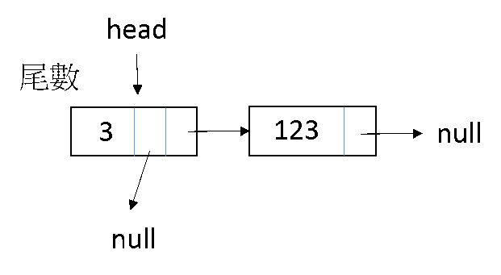
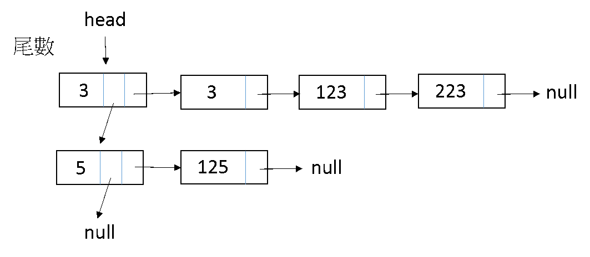

# 循環鏈結串列 Circularly Linked List

## 1. What is Cirularly LL? 什麼是循環？

也就是原本的最後一個節點指向第一個節點。

示意圖：  


## 2. Implementation 實作

非常簡單，新增節點時把 next 指標指向 head 就可以了！

___

### 練習 11-4

請設計一個 循環 Linked List 程式，節點結構為：
```C++
typedef struct data{
    int number;
    struct data *next;
}DATA;
```

有選單，可以用以下功能：

* 新增資料
	* 在最後面新增一筆資料
* 刪除
	* 輸入要刪除的位置，執行刪除
* 印出所有資料
	第3個功能，必須從最後一個資料開始印，而不是從head開始。  
	例如 1 -> 2 -> 3 -> 4 -> 5，必須印出 5, 1, 2, 3, 4。


### 回家練習 11-5

請設計一 C/C++ 程式實作 二維(Two-Dimensional) 排序鏈結串列。程式要求如下：
* 程式開始時為一空串(Null list)。
* 讓使用者選擇要產生幾個亂數，由程式自動亂數產生介於1~999之間的整數，將此亂數依尾數(個位數)分組串連。  
(如Fig.(1)產生的亂數為123，且串列中初始並沒有尾數為3的組別，則建立一個尾數為3的組別後，將此亂數123按適當位置(即依序)串連於此組別內)
* 清除螢幕資料後印出目前串列狀態。
* 不斷重複前兩個步驟，將不重複的亂數依分組由小到大排列後串接起來，直到結束程式。  
	(範例Fig.(2)，意謂若之後產生的亂數順序為3、223、125時，則將3、223加入原有的組別3串列中，而125則創建一個新組別5後再存於此串列中)

註：
* 必須讓使用者選擇要產生幾個亂數，產生出來的亂數不可以重複。  
* 使用者選擇的亂數數量加上目前串列的長度，若超過 999，則印出錯誤，要求重新輸入。  
* 此題需用鏈結串列(Linked List) 設計，程式碼數量、美觀、效率...等則列入加分考量。  
* 若產生的某個亂數已存在於串列中，則告知使用者，這個亂數不會被新增。  
* 此程式需循環執行，直到使用者結束此程式。
 
Fig.(1)  
  

Fig.(2)  
  

___

