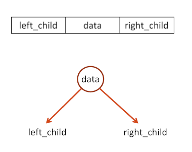
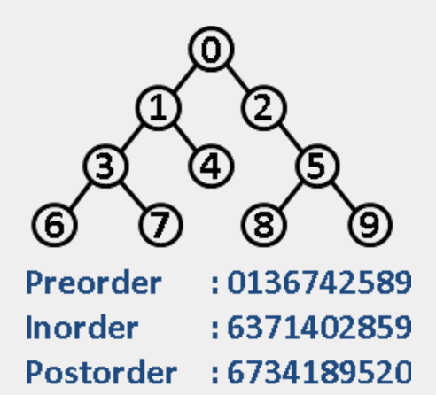
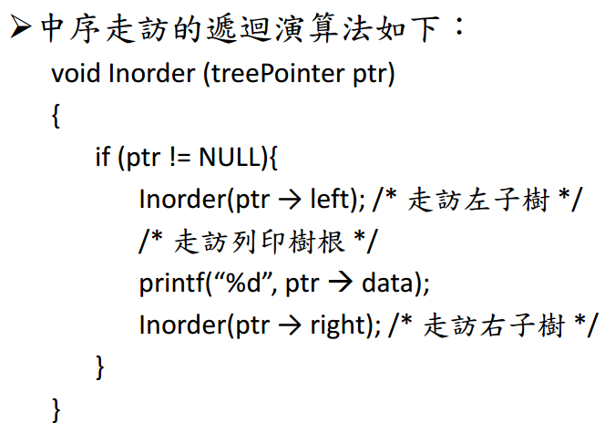
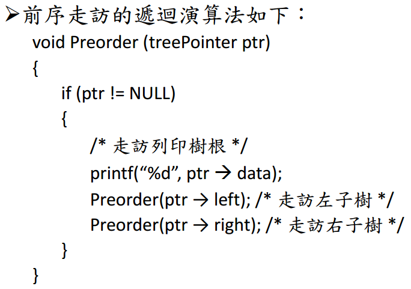
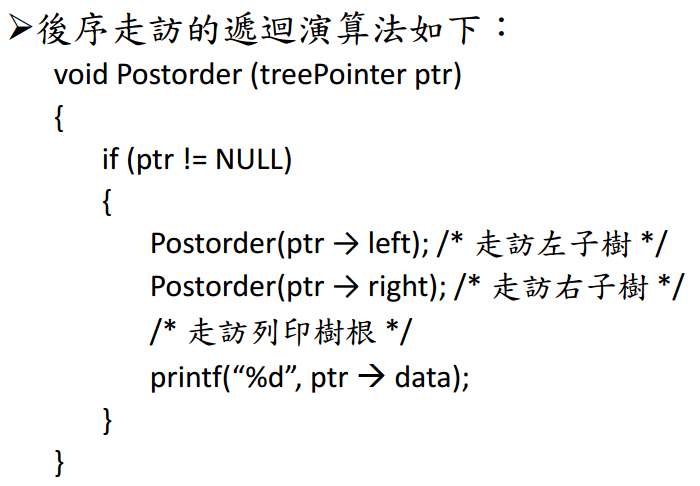

# Chapter 13：木葉旋風 Tree

中文：樹

> 別人的樹是由下往上長，我們由上往下長。

## 各項樹簡介

舉凡從企業內的組織架構、家族內的族譜關係再到電腦領域中的作業系統與資料庫管理系統都是樹狀結構的衍生運用。

- 完滿二元樹(Fully binary tree)
- 完整二元樹(Complete binary tree)
- 歪斜樹(skewed binary tree)
- 嚴格二元樹(strictly binary tree)

詳細請見正課講義。

## 以linked list實作運算樹(Expression Trees)

這其實也就是一個二元樹，只是我們需要將運算式的內容依序塞入樹中
我們要如何建立一個以LL為實作基準的二元樹呢?

### node

再節點上面我們可以看到其實只需要照著如

上圖去建立，有一個值value以及兩邊的pointer即可

好，那接下來怎麼建立我們的運算樹呢?
其實我們需要有一些先建立的基本知識

### 輸入

當我們再建立運算樹的時候會先將輸入轉為**後序式**
這我們這樣做的時候，就可以比較方便的建立運算樹

### 如何將後序式建成tree

其實當我們要將後序式建成tree的時候我們可以利用一個stack來做，我們可以利用迴圈來幫助我們讀取輸入的字串，並依據下列順序來做
- 如果是運算元(1、2、3...等)則push進stack
- 如果是運算子(+、-、*...等)則pop出兩項value並利用該運算子所建立之node建立連結，之後再將該運算子節點push入stack。

經由上述的步驟即可將後序式建立成tree

## 練習
好啦 既然演算法都告訴大家了，那也該開始實作拉~各位加油!!

## 樹的走訪
當我們根據上面的方法把樹建立起來之後，那又該怎麼去走訪呢?
這個部份其實在正課的講義已經有了，所以這邊我們簡單舉一個例子
如圖:

各項走訪我們參考正課講義
### 中序走訪的遞迴演算法

### 前序走訪的遞迴演算法

### 後序走訪的遞迴演算法

依據上述的虛擬碼其實就可以依序以三種方式走訪該tree。