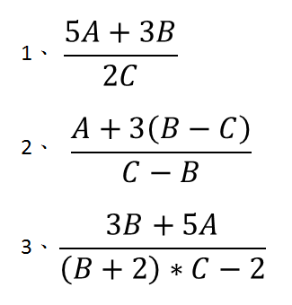

# 練習

## 練習 3-1
請輸入三個數字A、B即C
並讓程式幫你印出
以下圖片三個式子的輸出值  

## 練習 3-2
請模擬一次性販賣機，讓使用者輸入金額，並選擇a~d四種產品，若能夠購買則顯示購買成功並顯示退幣，若錢不夠則顯示購買失敗，販賣機商品及價錢請參考下表。

| **商品代號** | **價錢** |
|:-----:|:----:|
|a|10|
|b|50|
|c|100|
|d|87|

例子1

	請投入金額：50
	a:10
	b:50
	c:100
	d:87
	請輸入商品代號：a
	商品a購買成功，退幣40元

例子2

	請投入金額：50
	a:10
	b:50
	c:100
	d:87
	請輸入商品代號：d
	商品d購買失敗
